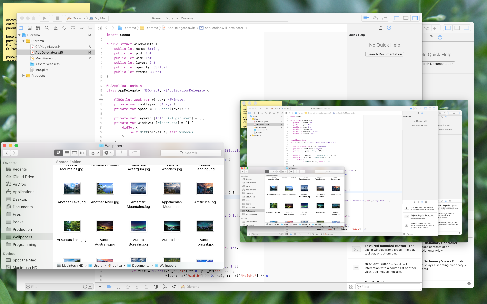

#  Diorama

Using `CAPluginLayer` and `CGWindowListCopyWindowInfo` to re-create the visual scene of the desktop. :smile:

*For those wondering, there is no security risk; all `CAPluginLayer` contents are only composited to screen and the application has no access.*
